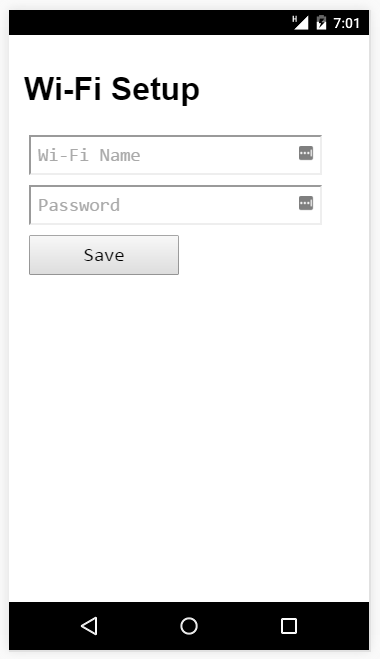

#Minimal

A very minimal HTML form that submits to `/update`, suitable for use as 
the `http_html_backup` within the source code itself.

| File                        | Size    | Purpose                                   |
|-----------------------------|---------|-------------------------------------------|
| `enduser_setup.html`        | 989     | Original, nicely formatted HTML           |
| `enduser_setup.html.min`    | 637     | A minified version                        |
| `enduser_setup.html.min.gz` | 361     | Gzipped version of .min made using Zopfli |
| `http_html_backup.c`        |         | C source with byte array representation of the .gz file |

##How to use
Copy `enduser_setup.html.min.gz` to the NodeMCU filesystem and rename as `enduser_setup.html`.
