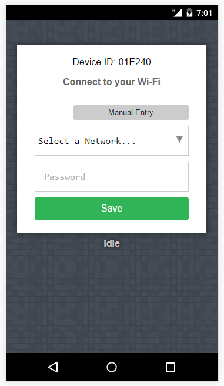

#Squares

A modified version of the html that Robert Foss (robertfoss) originally provided

| File                        | Size    | Purpose                               |
|-----------------------------|---------|---------------------------------------|
| `enduser_setup.html`        | 11025   | Original, nicely formatted HTML       |
| `enduser_setup.html.min`    | 6359    | A minified version (JavaScript not molested, though) |
| `enduser_setup.html.min.gz` | 3218    | Gzipped version of .min made using Zopfli |
| `http_html_backup.c`        |         | C source with byte array representation of the .gz file |

##How to use
Copy `enduser_setup.html.min.gz` to the NodeMCU filesystem and rename as `enduser_setup.html`.
